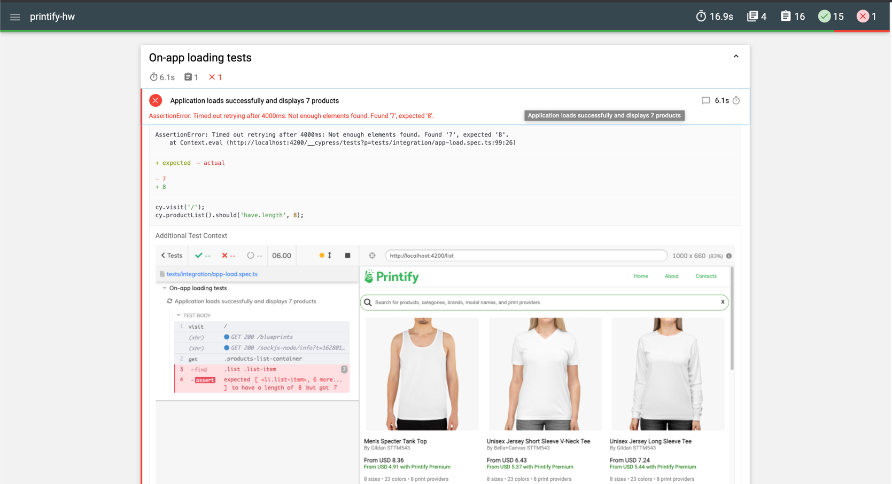
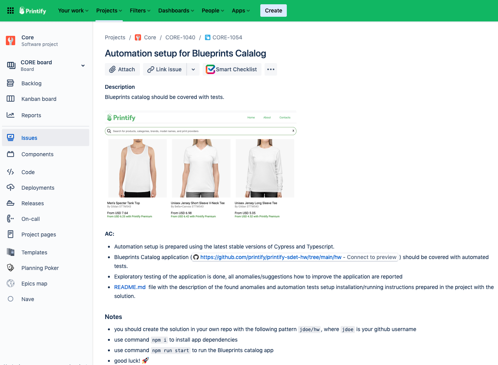

# Cypress automation homework

### Commands

1. `npm install` - installs necessary project dependencies
1. `npm run start` - launches the application at localhost:4200 (this is used as `baseURL` for tests)
1. `npm run test` - removes the `tests/reports` directory and runs all specs headlessly
1. `npm run serve-report` - merges and creates an HTML report of the previous run (from `reports/` dir)
    * Final report is located in `tests/reports/ready/report.html`. [Report example](./docs/reportSample.html) (open in Your browser of choice)
    * Failed tests will have screenshots attached like so  
      
    * To test the reporter with failed tests, feel free to modify any spec file to fail
    * HTML report is only available for the headless runs
1. `npm run cypress:cli` - opens cypress graphical user interface

### Project configuration / automation notes

1. I had to move contents of `browserlist` to package.json as cypress v8.1 was conflicting with this file. As per
   suggestion in [github](https://github.com/cypress-io/cypress/issues/8864)
1. Since the application is simple, I tried using the cypress suggested pattern of defining custom `cy` commands instead
   of defining page objects. Commands are located in [support/index.ts](./tests/support/index.ts)
1. In addition to cypress.io I used following npm packages:
    1. `mochawesome` test reporter for generating HTML reports
    1. `mocha` - necessary for mochawesome to work
    1. `mochawesome-merge` - necessary for merging mochawesome reports into one final report
    1. `rimraf` - package allows wiping directories independent of the platform it's used on

### Comments on defects / complaints

1. When opening the page, for a brief moment `No products found` can be seen. It would be better to implement some
   loading indicator
1. Some navigation buttons are not properly implemented, they redirect to `baseUrl/#` which leads home  
   It's not good to have misleading components in UI:
    * About
    * Contacts
1. Search problems:
    1. Fuzzy search would be better because searching for "womens" does not yield results, while "women's" does
    1. Search only works for product title, but not for other attributes suggested by placeholder *(Search for products,
       categories, brands, model names, and print providers)*. Either place-holder should be changed, or filtering
       capabilities improved.
    1. "Clear search" (x) button takes you home instead of simply removing the search query
    1. If search for products is performed while "No products found" is displayed on initial load, search will not work
       and all products will be loaded
1. Data issues
    1. Whenever list item is rendered, it gets a random price (xx.xx) and random premium price. This applies to opening
       the app, opening specific listing, searching for specific listing (every additional letter in the search bar
       updates the price value)
    1. All elements have the same amount of colors, amounts and print
       providers (`8 sizes • 23 colors • 8 print providers`)
    1. Not possible to see the options of those 8 sizes, 23 colors and 8 print providers
    1. When opening any listing, for a brief moment `8 sizes • 23 colors • 8 print providers` and nothing else can be
       seen. It would be nicer to have a loading indicator instead
1. Accessibility issues:
    1. UI element do not seem to have `active` css property, when navigating the website using `TAB`. It's impossible to
       see which element is currently active.
    1. It would be nice for the UI elements to get highlighted on mouse hover.
    1. Having a back button that takes you back to the previous search query from the viewed item listing would be nice

### Task

