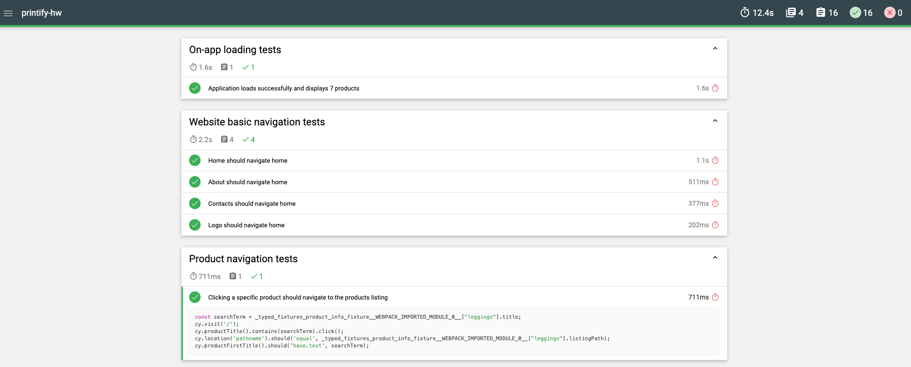
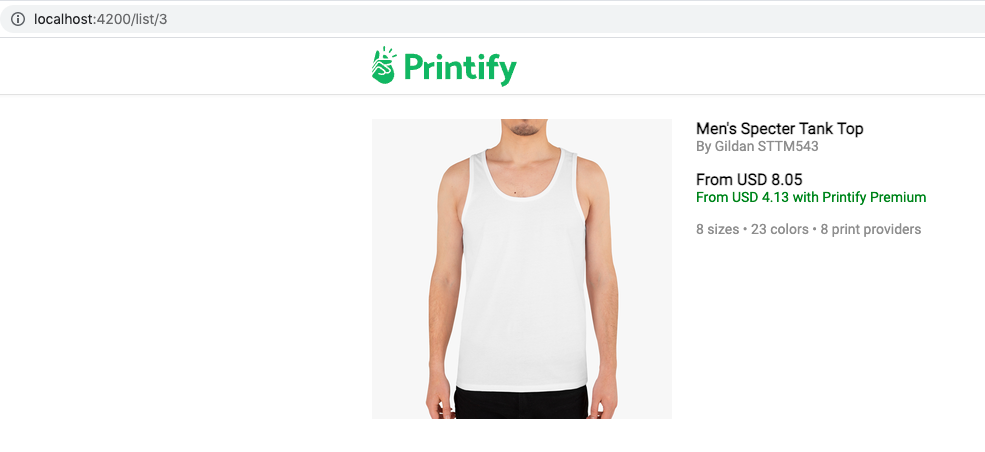

# HW review

**Browserslist**

> I had to move contents of `browserlist` to package.json as cypress v8.1 was conflicting with this file...

One of the ideas I got here that you could actually avoid mixing of app and test codebases and have cypress setup with tests in a
separate folder, so there would be lot less conflicts similar to that you mentioned.

**TSLint**

> /* tslint:disable:no-namespace */
>
> import { noProductsFound } from './constants';
>
> ...

**tslint** is [deprecated](https://www.infoq.com/news/2019/02/tslint-deprecated-eslint/#:~:text=Palantir%2C%20the%20creators%20of%20TSLint,linting%20solution%20for%20TypeScript%20users.), 
you should better avoid it, a better way could be to simply disable `tests` folder. A better linter is ESLint with cypress plugin [eslint-plugin-cypress](https://www.npmjs.com/package/eslint-plugin-cypress).

**Mochaawesome**

The reporter you added looks great - good job 👍

**Fuzzy search**

Good point 🦅. I didn't consider this functionality. Indeed, it could improve the actual search.

> Fuzzy search would be better ...

**Data issues**

⚠️ when you click on listing 3, it will return data for listing 1. We added it as "easter-egg" for the candidates as attentiveness exercise.
Probably you noticed it, but it was expected it would be documented in report.

